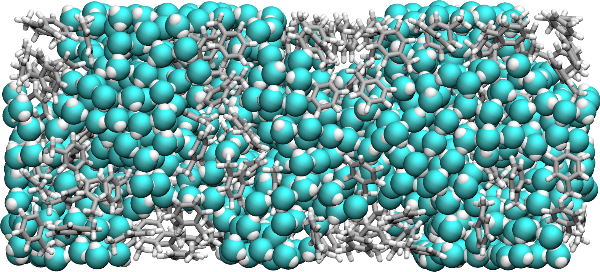

VMD tutorial
************

Guide to generate good-looking images and movies with VMD. You can access the
VMD tutorial `here <link_target_>`_. VMD version 1.9.3 was used.

.. _link_target: tutorial/vmd-tutorial.rst

These guides are provided as a support to the LAMMPS tutorial `webpage <lammps_tutorials_>`_.

.. _lammps_tutorials: https://lammpstutorials.github.io

About me & Contact
------------------

I am a computer physicist in soft matter and fluids at interfaces. You can 
find more information on my [personal webpage](https://simongravelle.github.io/).
