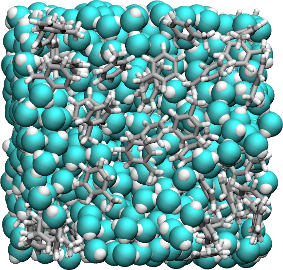
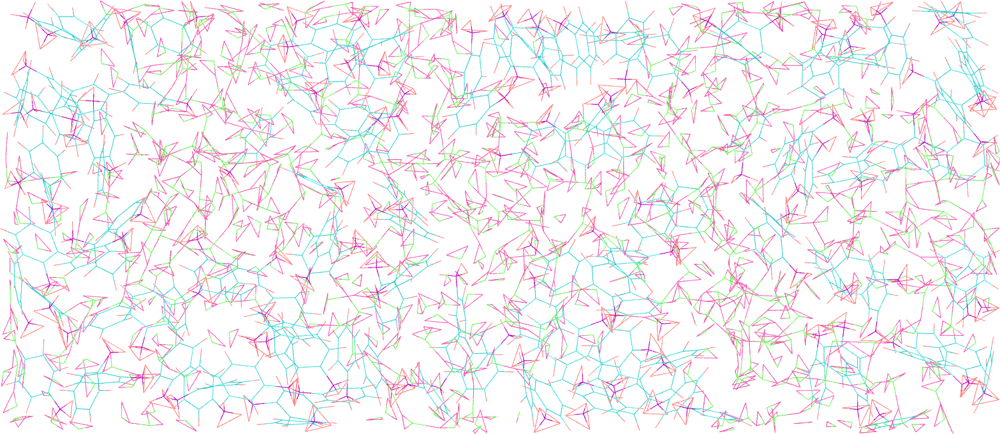
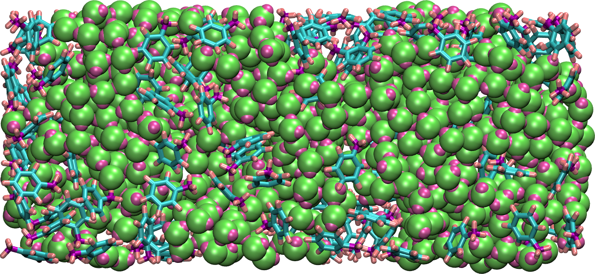
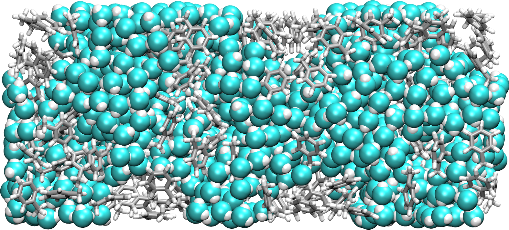
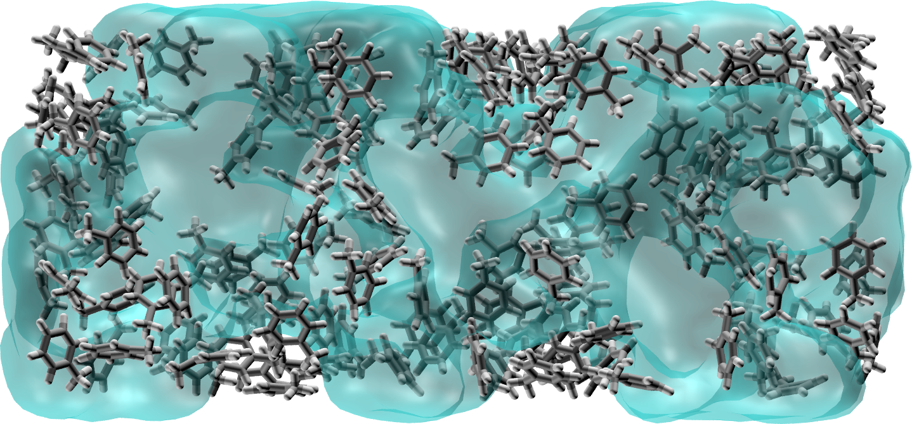
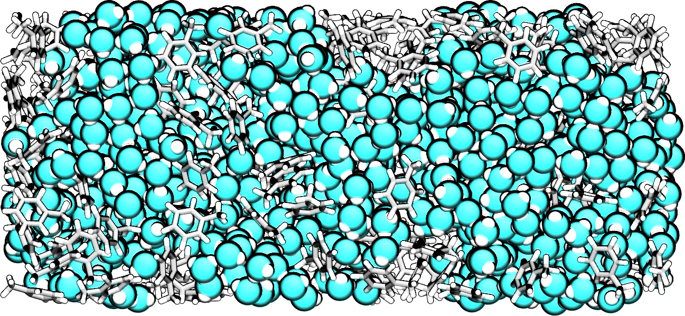

.. _vmd-label:

VMD tutorial
************

.. container:: hatnote

    Generate good-looking images and movies with VMD

Visual Molecular Dynamics (VMD) is a free molecular graphics software
that can be used to visualize molecular dynamics systems. VMD has been
used to generate all the images of molecular systems here. 

The goal of this extra tutorial is to provide some tips
to make good-looking pictures and videos of molecular systems.

Practical example
=================

To follow this tutorial, |dump_download| this LAMMPS trajectory file, which
corresponds to a mixture of water and toluene.

.. |dump_download| raw:: html

   <a href="files/dump.lammpstrj" target="_blank">download</a>

The water molecules use *types* 1 and 2, and the toluene molecules use
*types* 3, 4, and 5.

With Ubuntu/Linux, the *lammptrj* file can be opened with VMD by typing in a
terminal:

..  code-block:: bash
    
    vmd dump.lammpstrj

Otherwise, simply open VMD and import the *dump.lammpstrj* file manually
using *File -> New molecule*.

Go to *Display*, change the view to *Orthographic*, and unselect
*Depth Cueing*.

Still in *Display*, select
*Axes -> Off*.

Figure: Initial system in the absence of depth cueing and with orthographic
view.

The representation
------------------

In the main windows of VMD, go to *Graphics, Representations*.
Within the *Selected Atoms* windows,
replace *all*
by *type 1*.
Here, *type 1* corresponds to the oxygen of the water molecule. 
Change the *Drawing Method*
from *Lines*
to *VDW*.
Tune the *Sphere Scale*
to 0.9, and increase the resolution to 52.

Click on *Create Rep* to create a second representation for the hydrogen
of water, select *type 2*, and change the *Sphere Scale* to 0.5.

Create a third representation for *type 3 4 5*, i.e. all 3 atom types of toluene,
respectively carbon, hydrogen, and another carbon.

Choose *DynamicBonds* and increase the *bond resolution* to 52. With *DynamicBonds*,
the ends of the bonds are rough. To smooth out the representation, create the
fourth and last representation (*VDW* with *Sphere Scale* 0.2) for *types* 3 4 5*.

Figure: Orthographic view of the system with improved representation.

The colors
----------

To change the colors, go to *Graphics, Colors*,
click on *Display*, then *Background*, and choose 
the color you prefer (white is better for publication, black
can be good looking on presentation with a dark background).

Still in the *Color Controls* windows, in *Categories*, click *Name*. In the
*Names* sub windows choose *3* (carbon) and select the color silver. Then, do
the same for 5 (also a carbon → silver), 4 (hydrogen → white),
2 (hydrogen → white), 1 (oxygen → cyan).

Note that the cyan color is not standard for oxygen. Feel free to change it based
on your taste.

Let us slightly change the original *cyan* of VMD by entering manually the values
0.3, 1.0 and 1.0 in the RGB box.

Figure: Orthographic view with improved representation and color.

The materials
-------------

In the *Representations* windows, you can choose among several materials that
are more or less shiny or opaque. 
    
Let us select the default material named *Opaque*, and change *Diffuse*,
*Specular*, and *Shininess*, to 0.56, 0.12, and 0.29, respectively.

.. figure:: figures/step4.png
    :alt: VMD tutorial for LAMMPS

Figure: Orthographic view with improved representation, color, and material.
See the corresponding |vmd_video|.

.. |vmd_video| raw:: html

    <a href="https://youtu.be/PR7W3EM_t2w" target="_blank">video</a>

Additional options and rendering
================================

Transparent field
-----------------

A great representation offered by VMD is the *Quick surf*, that can be combined
with *transparent* material.

Here I turned off *Light 0*, and turned on all three other default lights.

Figure: System with water represented as a transparent field.

Goodsell
--------

VMD also offers the Goodsell cartoon-like representation, 
which can be an interesting alternative.

Figure: System in the style of David Goodsell.

Box border
----------

Optionally, you can visualize the borders of the simulation
box by typing in the VMD terminal:

..  code-block:: bash

    pbc box -center origin -color black -width 2

Saving a state
--------------

To avoid redoing all these steps every time VMD is re-opened, one can save the
VMD state by clicking *File → Save vizualisation state*. This state can then be
used simply by clicking *File → Load vizualisation state*.

Rendering image
---------------

To generate high a resolution image, go in *File → Render*,
choose *Tachyon*, hit *Start Rendering*.

Rendering movie
---------------

To generate a high-resolution movie, go into *Extension, Vizualisation*,
and *Movie Maker*.

If you hit *Make Movie* directly, the movie generated by VMD will be
of poor quality. Instead, it is better to generate a sequence of high-resolution
images, and assemble these images.

Go in *Movie Settings*, hit *Trajectory* (so the movie will show
the system evolving in time, and not rotating on itself),
Uncheck *Delete image files*.
In *Rendered*, choose *Tachyon*,
then hit *Make Movie*. 

From the Linux terminal (not the VMD terminal), assemble the images
(all starting with *untitled*) into a single movie by typing:

..  code-block:: bash

    ffmpeg -r 60 -i untitled.%05d.ppm -vcodec libx264 \
        -crf 0  -pix_fmt yuv420p myvideo.mp4

You may receive the following error:
    
..  code-block:: bash
    
    width not divisible by 2 (1363x1134)

In that case, simply remove one line of pixel with the command:

..  code-block:: bash

    for file in untitled.*.ppm; do convert $file -crop 1362x1134+0+0 $file; done

To convert the video in *webp*, for web integration, use:

..  code-block:: bash

    ffmpeg -i myvideo.mp4 -vcodec libwebp -filter:v fps=fps=20 \
        -lossless 1 -loop 0 -preset default -an -vsync 0 myvideo.webp
